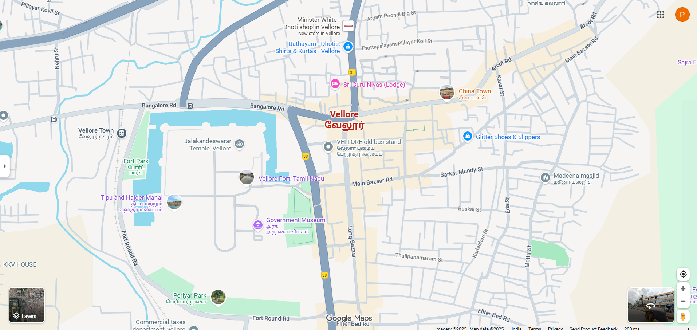

# Ex04 Places Around Me
## Date: 24gi/09/2025

## AIM
To develop a website to display details about the places around my house.

## DESIGN STEPS

### STEP 1
Create a Django admin interface.

### STEP 2
Download your city map from Google.

### STEP 3
Using ```<map>``` tag name the map.

### STEP 4
Create clickable regions in the image using ```<area>``` tag.

### STEP 5
Write HTML programs for all the regions identified.

### STEP 6
Execute the programs and publish them.

## CODE
```
<html>
    <head>
        <title> My City </title>
    </head>
    <body>
        <h1 align="center"><font color="blue"><b> VELLORE</b></font></h1>
        <h2 align="center"><font color="'blue"><b> POORNIMA J(25015718)</b></font></h2>
        

<map name="image-map">
    <area target="" alt="Vellore fort" title="Vellore fort" href="fort.html" coords="576,430,958,552" shape="rect">
    <area target="" alt="China Towm" title="China Towm" href="china.html" coords="1161,176,1466,362" shape="rect">
    <area target="" alt="Sri Guru Nivas" title="Sri Guru Nivas" href="lodge.html" coords="926,217,186" shape="circle">
    <area target="" alt="Periyar Park" title="Periyar Park" href="park.html" coords="348,733,834,901" shape="rect">
    <area target="" alt="Madeena Masjid" title="Madeena Masjid" href="masjid.html" coords="1497,610,1640,618,1728,511,1661,346,1510,345,1422,484" shape="poly">
</map>
    </body>
</html>

china.html

<html>
    <head>
        <body bgcolor="purple">
            <h1 align="center"><font color="cyan" size="20"><b>China Town</b></font></h1>
            <p align="justify"><font color="white" size="'15">
                China Town is a restaurant which has variety of south indian dishes.It is also a non-veg restaurant.
                Customers can't expect chinese dishes because of the name of the restaurant.Food is
                good.And It is located in the address of 118, Arcot Rd, opp. CMC Hospital, Sripuram, Vellore, Tamil Nadu 632004

            </font> 
                
            </p>

        </body>
    </head>
</html>

masjid.html

<html>
    <head>
        <body bgcolor="black">
            <h1 align="center"><font color="yellow" size="20"><b>Madeena Masjid</b></font></h1>
            <p align="justify"><font color="white" color="'15">
                "Madeena Masjid" refers to one of two mosques in Vellore: the one located in Saidapet or the one in Madheena Nagar. These are local places of worship for Muslims, and their specific architecture or history.You can find this mosque in the Saidapet area of Vellore. You can find this mosque in the Saidapet area of Vellore. You can find this mosque in the Saidapet area of Vellore. Another mosque, named Al Madeena Masjid, is located in Madheena Nagar, Vellore. Like all mosques, these are buildings dedicated to the worship of Allah and serve as a place for the Muslim community to gather, pray, and seek spiritual guidance. 
            </font> 
                
            </p>

        </body>
    </head>
</html>

park.html

<html>
    <head>
        <body bgcolor="black">
            <h1 align="center"><font color="yellow" size="20"><b>Madeena Masjid</b></font></h1>
            <p align="justify"><font color="white" color="'15">
                Periyar Park in Vellore is a well-maintained recreational space featuring lush greenery, serene walking paths, and a dedicated children's play area, making it a popular destination for family outings and peaceful relaxation. Visitors can enjoy the vibrant gardens, designated areas for skating and running, and a special section for observing various bird species. 
            </font> 
                
            </p>

        </body>
    </head>
</html>

fort.html

<html>
    <head>
        <body bgcolor="red" >
            <h1 align="center"><font color="black" size="20"><b>Vellore Fort</b></font></h1>
            <p align="justify"><font color="white" size="10">
                Vellore Fort, built in the 16th century by the Vijayanagara Empire, is a 133-acre granite structure known for its robust architecture and the unique presence of a Hindu temple, mosque, and church within its walls. It later served as a significant site for the British East India Company, where the Vellore Mutiny of 1806, the first major uprising against British rule, occurred. 

            </font> 
                
            </p>

        </body>
    </head>
</html>

lodge.html

<html>
    <head>
        <body bgcolor="purple">
            <h1 align="center"><font color="cyan" size="20"><b>Sri Guru Nivas</b></font></h1>
            <p align="justify"><font color="white" size="15">
               Sri Guru Nivas Lodge is loceted in the address of #33/3, Timber Depot, G.Manicka Mudali Lane 24hrs Parking point facility, Katpadi Main Rd, opp. to CMC out gate, Vellore, Tamil Nadu 632004. The inner decor has a writing desk, while it also features garden views. The Vellore accommodation comes with a bathroom with a bathtub and a separate toilet.

            </font> 
                
            </p>

        </body>
    </head>
</html>


```

## OUTPUT


## RESULT
The program for implementing image maps using HTML is executed successfully.
